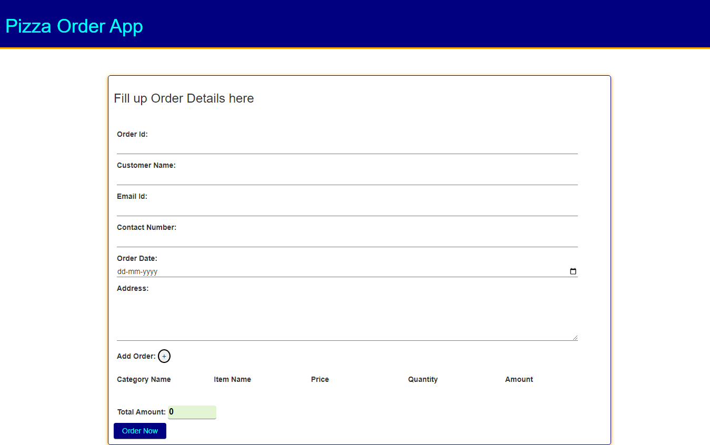

## Challenge - Wat-a-Pizza

#### Problem Statement

Wat-a-pizza is a pizza delivery outlet that became popular for its custom-made vegetarian pizzas. ​

A customer orders pizzas and other items by placing the order on the phone. The outlet delivers the orders received ​on phone at the address given by the customer.​

​The owners now have an app that allows the​ call operator to enter the order details ​and store them.​

#### Context 

Wat-a-pizza outlet owners now have an app that helps them share menu details with the customers who want to place orders on call. ​

The app should also allow the outlet team to capture the orders and store them. ​

The order form should allow the operator to store the customer details, the items ordered and show the total bill amount that the customer needs to pay.

#### Task 1 – Create Order Form With Validations​

- Order form should be created with the fields and validations as listed.​

- The error messages should be displayed for the field inputs which do not fulfil the validation criteria.​

- The form with invalid inputs should not get submitted.

| Input Field​          | Validation​                                                      |
| --------------------- | ---------------------------------------------------------------- |
| Order Id​             | Should not be left blank​                                        |
| Order Date​           | Should be in correct date format​      |
| Customer Name​        | Should not be left blank                       |
|  Email Id      | Should not be left blank and should allow input of type email​   |
| Contact Number      | Should not be left blank  and  takes only 10 digitted number​​                                         |
| Customer Address​ | Should not be left blank and should have minimum 10 characters                                      |
| Order Amount​         | Should be non-editable and get updated as order items are added​ |

Dynamically Added Form Fields

| Input Field​          | Validation​                                                      |
| --------------------- | ---------------------------------------------------------------- |
| Category​  | Should not be left blank​                                                |
| Item Name​ | Should not be left blank​                                                |
| Price​     | Should not be left blank and should allow only numbers. Default value should be 0​  ​     |
| Quantity​  | Should not be left blank and should allow only numbers. Default value should be 0​                  |
|Total Amount​    | Should be non-editable and get updated as price or quantity are updated. Default value should be 0​​ |

#### Task 2 – Add Order Items Dynamically

- On the Order form, add a button with “+” icon.​

- When the user clicks this button, input fields should get added dynamically allowing the user to input order item details such as​

   * Category – could be an input field that allows the user to input category.​

  * Item name –  could be an input field that allows the user to input menu item.​

  * Price – could be an input field that allows only numbers to be inputted.

  * Quantity – could be a input field that allows only numbers to be inputted.​

  * Amount – could be a read-only field that displays the total amount whenever the price or quantity is updated.​

  * Add button, which when clicked, saves the order item in an array, makes all fields read only and unregisters click event of the Add button.​

     * The button should be associated with click event listener programmatically to handle the click event.​

#### Task 3 – Calculate Bill Amount​

- As the user enters order items, the text field for `Total Bill Amount` should get continuously updated with the sum of the amount of all order items.​

- The field should not be editable and should display the value as "0" initially.

#### Task 4 – Save Order

- On clicking the “Save Order” button, the order with all details should be captured. ​

- Store the captured details in an array storing order details. ​

- Raise an alert that confirms the successful completion of the transaction by displaying the following message :​

    `Total amount to be paid: <totalAmount>`

#### Instructions for Challenge

- Author the code in script.js file under `js` folder. ​​

- Author the style in style.css under `css` folder.

- Open the index.html file using Live Server and test the output.​​

​

​
